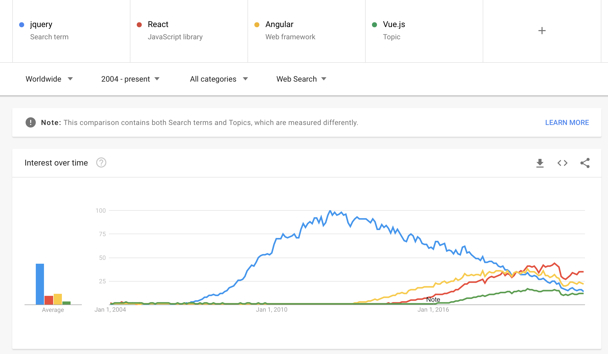

# Frontend

Server Side Rendering (htmlphp, design, databas, oophp/mvc)

Frontend (javascript, webapp)

Nu ska vi göra lite annorlunda.

En klient (frontend) och en server (backend)

Två kataloger och GitHub repon från och med nästa vecka.

## Ramverk

Lite historik:

Vem, vad, varför?

Angular: Google, Google Spreadsheets, docs etc, Scaling Issues.

React: Facebook, Facebook, Facebook [Why did we build React?](https://reactjs.org/blog/2013/06/05/why-react.html)

Vue: "I figured, what if I could just extract the part that I really liked about Angular and build something really lightweight." Fristående projekt.
